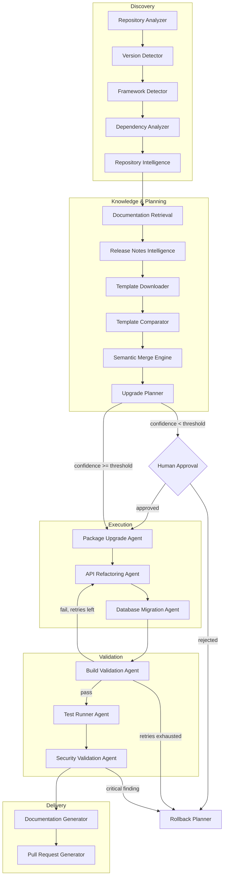

# UpgradePilot Agent Architecture

Status: Draft v0.1 · Owner: CTO/Architecture · Scope: `upgradepilot-core`, `upgradepilot-mcp`

This document defines the multi-agent architecture that powers the 17-step upgrade
workflow. It specifies the orchestration pattern, the shared memory model, the common
agent contract, and a full spec (purpose, responsibilities, inputs, outputs, memory,
MCP tools, retry strategy, validation rules, success criteria) for every agent.

---

## 1. Design Decisions

### 1.1 Orchestration pattern: Saga + Blackboard (not a monolithic planner loop)

**Decision:** A `UpgradeSaga` (MassTransit state machine, persisted, driven by Hangfire
background jobs) coordinates the 17 workflow steps. Agents do not call each other
directly. Each agent consumes a `Command`, does its work, and publishes an `Event`. The
saga listens for events and decides the next command.

**Why not a single LLM "planner" loop calling tools in sequence?** The workflow is
long-running (minutes to hours), must survive process restarts, must be resumable after
a human approval gate, and must be independently observable per step (OpenTelemetry
span per agent invocation). A stateless in-process agent loop can't give us that; a
persisted saga can. It also lets us swap or retry a single failed step without re-running
the whole pipeline — critical for cost control when steps call LLMs.

**Why a blackboard alongside the saga?** Passing full repository contents through message
bus events is wrong (payload size, versioning pain). Instead, each agent reads/writes to
a shared `UpgradeContext` (Postgres-backed, Redis-cached) keyed by `SessionId`. Bus
messages carry only `SessionId` + a small result summary + confidence deltas. This keeps
the bus lightweight and gives us a single place to reconstruct "what did we know at step
N" for audit/explainability — a hard requirement per our core values.

**Tradeoff accepted:** the blackboard is a shared-mutable-state pattern, which fights
DDD/bounded-context purity. We contain the damage by making `UpgradeContext` an
append-only event log (each agent writes a new fact, never mutates a prior one) rather
than a mutable bag — so it doubles as the audit trail and the rollback/reproducibility
mechanism.

### 1.2 Memory model

Three tiers, all version-aware (a hard product requirement):

| Tier | Store | Lifetime | Purpose |
|---|---|---|---|
| Working memory | Postgres (`upgrade_context_facts`) + Redis cache | Per session | Blackboard: accumulated facts from each agent, append-only |
| Knowledge memory | Qdrant (RAG) | Persistent, versioned by framework+version | AspNet Zero/ABP/.NET docs, release notes, migration guides |
| Episodic memory | Postgres (`upgrade_runs`) | Persistent, per customer/repo | Outcomes of prior upgrades — feeds confidence scoring so the Upgrade Planner learns which patterns historically needed human correction |

### 1.3 Common agent contract

Every agent — first-party or community-contributed — implements the same shape so the
saga, retry policy, and telemetry pipeline are agent-agnostic:

```csharp
public interface IUpgradePilotAgent<TInput, TOutput>
{
    string AgentId { get; }              // stable id, e.g. "template-comparator"
    string Version { get; }              // semver, independently releasable
    RetryPolicy RetryPolicy { get; }      // Polly policy, agent declares its own

    Task<AgentResult<TOutput>> ExecuteAsync(
        TInput input, UpgradeContext context, CancellationToken ct);

    Task<ValidationResult> ValidateAsync(
        TOutput output, UpgradeContext context);
}
```

`AgentResult<T>` always carries: the typed output, a `Confidence` score (0–100), a
human-readable `Explanation` (non-negotiable — every automated decision must be
explainable), and a list of `Citations` (RAG source docs / template diffs it relied on).

### 1.4 MCP tool surface

Agents don't get raw filesystem/git/network access — they call MCP tools exposed by
`upgradepilot-mcp`, sandboxed per session (isolated container + git worktree). Tool
namespaces: `repo.*`, `git.*`, `template.*`, `build.*`, `test.*`, `rag.*`, `release.*`,
`db.*`, `security.*`, `pr.*`, `docs.*`. This is also the community extension point:
third-party framework adapters register new tools/agents without touching core.

### 1.5 Confidence gate & human-in-the-loop

The `UpgradeSaga` transitions to `AwaitingApproval` whenever any agent reports
confidence below its configured threshold (default 85, tunable per org) — this is
workflow step 10. Approval reopens the saga at the same step; rejection triggers the
Rollback Planner. Thresholds and the full confidence breakdown are shown to the user,
never hidden.

### 1.6 Reversibility

Before step 11 (Execute upgrade) begins, the Rollback Planner snapshots a pre-image:
a git ref (branch/tag) plus captured EF Core down-migrations. Every execution agent
(Package Upgrade, API Refactoring, Database Migration) works on an isolated worktree
branch, never on the customer's target branch directly, until validation passes and the
PR is generated. This is what makes "every upgrade must be reversible" true by
construction, not by convention.

---

## 2. Pipeline overview



---

## 3. Agent registry

| # | Agent | Phase | One-line purpose |
|---|---|---|---|
| 1 | Repository Analyzer | Discovery | Structural scan of the codebase |
| 2 | Version Detector | Discovery | Pin exact current framework/package versions |
| 3 | Framework Detector | Discovery | Identify which product/frontend variant is in play |
| 4 | Dependency Analyzer | Discovery | Build dependency graph, flag outdated/vulnerable packages |
| 5 | Repository Intelligence | Discovery | Git-history-aware customization & risk heatmap |
| 6 | Documentation Retrieval | Knowledge | Version-aware RAG lookup |
| 7 | Release Notes Intelligence | Knowledge | Classify breaking changes between versions |
| 8 | Template Downloader | Knowledge | Fetch official clean templates (old + new) |
| 9 | Template Comparator | Knowledge | Isolate customer customizations from template code |
| 10 | Semantic Merge Engine | Knowledge | AST-level three-way merge |
| 11 | Upgrade Planner | Knowledge | Synthesize plan + confidence score |
| 12 | Package Upgrade Agent | Execution | Bump NuGet/npm references |
| 13 | API Refactoring Agent | Execution | Apply codemods for breaking API changes |
| 14 | Database Migration Agent | Execution | Generate/update EF Core migrations |
| 15 | Build Validation Agent | Validation | Compile in sandbox, interpret errors |
| 16 | Test Runner Agent | Validation | Run test suite, report coverage delta |
| 17 | Security Validation Agent | Validation | SAST + vulnerable-dependency scan |
| 18 | Documentation Generator | Delivery | Produce upgrade report + changelog |
| 19 | Pull Request Generator | Delivery | Open PR with report + rollback instructions |
| 20 | Rollback Planner | Cross-cutting | Snapshot pre-image, execute rollback on failure/rejection |

---

## 4. Agent specifications

### 4.1 Repository Analyzer
- **Purpose:** Build a structural map of the target repository.
- **Responsibilities:** Enumerate solution/projects, detect entry points, map module
  boundaries, compute size/complexity metrics.
- **Inputs:** Repository URL or local path, access credentials.
- **Outputs:** `RepositoryMap` (projects, project types, LOC, entry points).
- **Memory:** Writes `RepositoryMap` fact to working memory. No long-term memory use.
- **MCP tools:** `repo.clone`, `repo.listProjects`, `repo.stat`
- **Retry strategy:** 3 attempts, exponential backoff (clone failures are usually
  transient network/auth issues); no retry on auth failure (fail fast, surface to user).
- **Validation rules:** At least one recognizable project file found; solution graph is
  acyclic.
- **Success criteria:** `RepositoryMap` produced with >0 projects and no orphaned
  project references.

### 4.2 Version Detector
- **Purpose:** Determine the exact current version of every relevant framework.
- **Responsibilities:** Parse `.csproj`/`Directory.Packages.props`/`package.json`,
  resolve AspNet Zero/ABP version from assembly metadata when package refs are ambiguous
  (common after manual patching).
- **Inputs:** `RepositoryMap`.
- **Outputs:** `VersionManifest` (framework → version, confidence per entry).
- **Memory:** Working memory only.
- **MCP tools:** `repo.readFile`, `repo.grep`
- **Retry strategy:** No retry needed (pure local parsing); on ambiguity, lower
  confidence rather than fail.
- **Validation rules:** Version strings must be valid semver or known AspNet
  Zero/ABP release tags.
- **Success criteria:** Core framework version resolved at ≥90 confidence.

### 4.3 Framework Detector
- **Purpose:** Identify which product variants are present (AspNet Zero MVC vs
  Angular vs Blazor front end, ABP vs legacy ASP.NET Boilerplate lineage).
- **Responsibilities:** Classify each project by framework signature; detect mixed
  variants (e.g., MVC core + Angular front end monorepo).
- **Inputs:** `RepositoryMap`, `VersionManifest`.
- **Outputs:** `FrameworkProfile` (list of detected frameworks + variant + project
  mapping).
- **Memory:** Working memory; reads Knowledge memory for signature matching rules.
- **MCP tools:** `repo.readFile`, `rag.search` (framework fingerprint library)
- **Retry strategy:** None (deterministic classification); escalate to LLM
  disambiguation only when signature match is inconclusive.
- **Validation rules:** Every project in `RepositoryMap` must be classified or
  explicitly marked "unsupported."
- **Success criteria:** 100% of projects classified, ≥1 supported framework detected.

### 4.4 Dependency Analyzer
- **Purpose:** Build the full dependency graph and flag risk.
- **Responsibilities:** Resolve NuGet + npm transitive graphs, flag deprecated/
  vulnerable/unmaintained packages, detect version conflicts.
- **Inputs:** `RepositoryMap`.
- **Outputs:** `DependencyGraph`, `DependencyRiskReport`.
- **Memory:** Working memory; queries Knowledge memory for known-vulnerable package
  advisories (version-aware).
- **MCP tools:** `build.restore`, `security.auditPackages`
- **Retry strategy:** 2 attempts on package feed timeouts; circuit breaker on
  NuGet/npm registry outage, degrade to cached advisory data.
- **Validation rules:** Graph must be fully resolved (no dangling references) before
  handoff.
- **Success criteria:** Dependency graph resolves cleanly; risk report includes
  severity for every flagged package.

### 4.5 Repository Intelligence
- **Purpose:** Understand how this specific repo has diverged and evolved, to protect
  customer customizations and inform risk.
- **Responsibilities:** Git blame/churn analysis to locate customization hot-spots
  relative to the template baseline, identify ownership (CODEOWNERS/authorship),
  surface prior upgrade attempts from commit history.
- **Inputs:** `RepositoryMap`, git history.
- **Outputs:** `CustomizationHeatmap`, `OwnershipMap`.
- **Memory:** Writes to working memory; writes summary to Episodic memory for future
  runs against the same repo.
- **MCP tools:** `git.log`, `git.blame`, `git.diffStat`
- **Retry strategy:** 2 attempts; shallow-clone fallback if full history unavailable.
- **Validation rules:** Heatmap must cover 100% of files touched by the eventual merge
  (cross-checked after Template Comparator runs).
- **Success criteria:** Every file with >20% customization churn is flagged before
  planning begins.

### 4.6 Documentation Retrieval
- **Purpose:** Retrieve version-aware documentation relevant to the detected and
  target versions.
- **Responsibilities:** Query the RAG knowledge base (AspNet Zero/ABP docs, Microsoft
  Learn, migration guides) scoped to the exact version range being upgraded.
- **Inputs:** `VersionManifest`, target version.
- **Outputs:** `DocumentationBundle` (ranked passages + citations).
- **Memory:** Reads Knowledge memory (Qdrant); no writes.
- **MCP tools:** `rag.search`, `rag.getDocument`
- **Retry strategy:** 3 attempts on vector store timeout; fall back to keyword search
  if embedding service is degraded.
- **Validation rules:** Every returned passage must carry a resolvable source citation
  and a version tag within range.
- **Success criteria:** ≥1 relevant, correctly version-scoped document per major
  breaking-change category.

### 4.7 Release Notes Intelligence
- **Purpose:** Turn raw release history into a structured breaking-change ledger.
- **Responsibilities:** Pull GitHub Releases/commits between current and target
  version, classify each item (breaking / deprecation / feature / fix), rank by blast
  radius using the `DependencyGraph` and `CustomizationHeatmap`.
- **Inputs:** `VersionManifest`, target version, `DependencyGraph`,
  `CustomizationHeatmap`.
- **Outputs:** `BreakingChangeLedger` (each item: description, severity, affected
  files, citation).
- **Memory:** Reads Knowledge memory; writes ledger to working memory.
- **MCP tools:** `release.listBetween`, `release.getCommits`, `rag.search`
- **Retry strategy:** 3 attempts, exponential backoff (GitHub API rate limits);
  respects `Retry-After`.
- **Validation rules:** Every ledger item must cite a source release/commit — no
  unsourced claims about breaking changes.
- **Success criteria:** Ledger classifies 100% of ingested release items; no item left
  "unclassified."

### 4.8 Template Downloader
- **Purpose:** Obtain trustworthy, verifiable official templates for both the current
  and target version.
- **Responsibilities:** Fetch official clean-template source (release artifact or
  tagged repo), verify checksums/signatures, cache locally per version.
- **Inputs:** `VersionManifest`, target version, `FrameworkProfile`.
- **Outputs:** `TemplateBaseline` (paths to current-version and target-version
  templates).
- **Memory:** Working memory (pointers only); templates cached on disk keyed by
  version, shared across sessions.
- **MCP tools:** `template.fetch`, `template.verifyChecksum`
- **Retry strategy:** 3 attempts with backoff; on checksum mismatch, no retry — hard
  fail and alert (integrity issue, not transient).
- **Validation rules:** Checksum/signature must verify before the template is used by
  any downstream agent.
- **Success criteria:** Both baselines present on disk and checksum-verified.

### 4.9 Template Comparator
- **Purpose:** Separate "what the customer changed" from "what the template changed" —
  the core mechanism protecting customer business logic.
- **Responsibilities:** AST-level diff (tree-sitter) between customer repo and
  current-version template baseline to produce the customization set; AST diff between
  current-version and target-version templates to produce the template-change set.
- **Inputs:** `TemplateBaseline`, `RepositoryMap`, `CustomizationHeatmap`.
- **Outputs:** `CustomizationSet`, `TemplateChangeSet` (both AST-node-level, not
  line-level).
- **Memory:** Working memory.
- **MCP tools:** `repo.readFile`, `template.astDiff`
- **Retry strategy:** No retry on parse failure of a given file — flag file as
  "unparseable, manual review required" rather than silently skip it.
- **Validation rules:** Every file in the repo must land in exactly one bucket:
  unchanged / customized / template-only-changed / both-changed. No file unaccounted
  for.
- **Success criteria:** 100% file coverage; customization set matches
  `CustomizationHeatmap` within tolerance (cross-validation between two independent
  signals).

### 4.10 Semantic Merge Engine
- **Purpose:** Apply template changes into customer code without destroying
  customizations — three-way AST merge, never regex/text patching.
- **Responsibilities:** For each file in `TemplateChangeSet`, merge in the template
  delta while preserving nodes in `CustomizationSet`; produce a conflict when a
  customization and a template change touch the same AST node.
- **Inputs:** `TemplateBaseline`, `CustomizationSet`, `TemplateChangeSet`.
- **Outputs:** `MergeResult` (merged file set + `ConflictList` with per-conflict
  confidence).
- **Memory:** Working memory; queries Knowledge memory for known merge patterns from
  prior community-contributed upgrade rules.
- **MCP tools:** `template.astMerge`, `repo.writeFile` (writes to isolated worktree
  only)
- **Retry strategy:** Not retried automatically — a merge conflict is a planning
  input, not a transient failure.
- **Validation rules:** Merged AST must still parse/compile-check syntactically before
  being handed to the Upgrade Planner; every conflict must carry an explanation.
- **Success criteria:** Every file either merges cleanly or is captured as an explicit,
  explained conflict — zero silent overwrites of customization nodes.

### 4.11 Upgrade Planner
- **Purpose:** Synthesize every upstream signal into a single, ordered, explainable
  upgrade plan with a confidence score.
- **Responsibilities:** Sequence execution steps, aggregate risk from
  `BreakingChangeLedger` + `ConflictList` + `DependencyRiskReport`, compute overall
  confidence, decide whether the human-approval gate triggers, query Episodic memory
  for similar-repo outcomes.
- **Inputs:** All prior agent outputs for the session.
- **Outputs:** `UpgradePlan` (ordered steps, risk register, `ConfidenceScore`,
  approval decision).
- **Memory:** Reads working + episodic memory; writes final plan to working memory
  (session's plan-of-record).
- **MCP tools:** `rag.search` (precedent lookup)
- **Retry strategy:** N/A — deterministic aggregation over already-validated inputs.
- **Validation rules:** Every risk item in the register must trace to a source agent
  output (no fabricated risks); confidence score must be reproducible from its inputs
  (documented formula, not a black-box LLM number alone).
- **Success criteria:** Plan produced with full traceability; confidence and approval
  decision match policy thresholds.

### 4.12 Package Upgrade Agent
- **Purpose:** Execute package/reference version bumps per the plan.
- **Responsibilities:** Update `.csproj`/`Directory.Packages.props`/`package.json`,
  regenerate lock files, resolve version-range conflicts flagged earlier.
- **Inputs:** `UpgradePlan` (package steps), `DependencyGraph`.
- **Outputs:** Modified files on the isolated worktree branch; `PackageUpgradeReport`.
- **Memory:** Working memory (execution log, append-only — this is the audit trail).
- **MCP tools:** `repo.writeFile`, `build.restore`
- **Retry strategy:** 2 attempts on registry timeouts; on real version conflict, no
  retry — surface to Build Validation Agent's error loop.
- **Validation rules:** Post-update restore must resolve with no version conflicts.
- **Success criteria:** All planned package bumps applied and restore succeeds.

### 4.13 API Refactoring Agent
- **Purpose:** Apply source-level fixes for breaking API changes.
- **Responsibilities:** Apply Roslyn code-fix providers/codemods per
  `BreakingChangeLedger` item; consumes structured compiler errors from Build
  Validation Agent on retry loops and targets fixes at the specific diagnostic.
- **Inputs:** `BreakingChangeLedger`, `MergeResult`, (on retry) `BuildErrorReport`.
- **Outputs:** Modified files on worktree; `RefactoringReport` (per-change
  explanation + citation to the breaking-change item).
- **Memory:** Working memory; queries Knowledge memory for known codemods
  (community-contributed rules are a first-class extension point here).
- **MCP tools:** `repo.writeFile`, `build.applyCodeFix`
- **Retry strategy:** Bounded loop with Build Validation Agent — max 3 rounds, each
  round scoped to the specific failing diagnostics only (never a full re-run).
- **Validation rules:** Every change must cite the ledger item that motivated it — no
  unexplained edits.
- **Success criteria:** Zero remaining diagnostics tied to known breaking changes.

### 4.14 Database Migration Agent
- **Purpose:** Bring the database schema forward safely.
- **Responsibilities:** Generate/update EF Core migrations for entity model changes
  introduced by the upgrade; flag destructive operations (column/table drops) for
  explicit review; produce down-migrations for rollback.
- **Inputs:** `MergeResult`, `RefactoringReport`.
- **Outputs:** Migration files; `MigrationSafetyReport`.
- **Memory:** Working memory.
- **MCP tools:** `db.addMigration`, `db.scriptMigration`
- **Retry strategy:** No retry on generation failure — schema conflicts are a planning
  concern, escalated to Upgrade Planner via the saga's error path.
- **Validation rules:** Every migration must have a corresponding down-migration;
  destructive operations require explicit flag in `MigrationSafetyReport` (never
  silently applied).
- **Success criteria:** Migration set applies cleanly to a shadow database snapshot.

### 4.15 Build Validation Agent
- **Purpose:** Prove the upgraded code compiles.
- **Responsibilities:** Run `dotnet build` and front-end build (npm/ng/webpack) in a
  sandboxed container; parse and structure errors for the API Refactoring Agent's
  retry loop.
- **Inputs:** Worktree state after execution agents run.
- **Outputs:** `BuildResult` (pass/fail), `BuildErrorReport` (structured diagnostics).
- **Memory:** Working memory (append per attempt — full history kept for audit even
  across retries).
- **MCP tools:** `build.compile`, `build.compileFrontend`
- **Retry strategy:** Own retries not needed (build is deterministic); it *drives* the
  API Refactoring Agent's bounded retry loop (max 3 rounds) rather than retrying
  itself.
- **Validation rules:** Build must be run in a clean sandbox matching target framework
  TFM — no reliance on developer machine state.
- **Success criteria:** Zero compiler errors across all projects.

### 4.16 Test Runner Agent
- **Purpose:** Prove behavior is preserved.
- **Responsibilities:** Execute existing test suite against the upgraded code; report
  pass/fail and coverage delta specifically on files touched by the merge.
- **Inputs:** Worktree state after Build Validation passes.
- **Outputs:** `TestResult` (pass/fail per test), `CoverageDelta`.
- **Memory:** Working memory.
- **MCP tools:** `test.run`, `test.coverage`
- **Retry strategy:** 1 retry only for flaky-test detection (re-run failures in
  isolation to distinguish flake from regression); no retry on deterministic failures.
- **Validation rules:** A failing test on a file inside `MergeResult`'s touched set is
  always treated as a regression signal, never auto-suppressed.
- **Success criteria:** 100% of pre-existing passing tests still pass; no coverage
  regression on touched files.

### 4.17 Security Validation Agent
- **Purpose:** Ensure the upgrade doesn't introduce or leave known vulnerabilities.
- **Responsibilities:** Run SAST (Roslyn analyzers/CodeQL) and dependency
  vulnerability scan (`dotnet list package --vulnerable`, npm audit) on the final
  worktree state.
- **Inputs:** Worktree state after Test Runner passes.
- **Outputs:** `SecurityReport` (findings by severity).
- **Memory:** Working memory; queries Knowledge memory for advisory database.
- **MCP tools:** `security.sastScan`, `security.auditPackages`
- **Retry strategy:** No retry (deterministic scan); on tool/service outage, circuit
  breaker blocks PR generation rather than silently skipping the scan.
- **Validation rules:** Any Critical/High finding blocks progression to Delivery phase
  by policy — no override without explicit human approval logged.
- **Success criteria:** No unresolved Critical/High findings.

### 4.18 Documentation Generator
- **Purpose:** Make the upgrade explainable to a human reviewer.
- **Responsibilities:** Produce the upgrade report (what changed, why, confidence
  breakdown, risks, citations) and update repo changelog/docs.
- **Inputs:** Full `UpgradeContext` for the session.
- **Outputs:** `UpgradeReport` (Markdown), changelog entry.
- **Memory:** Reads full working memory for the session; no writes beyond the report
  artifact.
- **MCP tools:** `docs.render`, `repo.writeFile`
- **Retry strategy:** N/A (deterministic rendering from already-validated data).
- **Validation rules:** Every claim in the report must trace to a fact in
  `UpgradeContext` — report generation must not introduce new, unsourced content.
- **Success criteria:** Report renders with no missing citations.

### 4.19 Pull Request Generator
- **Purpose:** Deliver the upgrade as a reviewable, mergeable artifact.
- **Responsibilities:** Push the worktree branch, open a PR with the `UpgradeReport`
  embedded, tag reviewers/CODEOWNERS from `OwnershipMap`, attach rollback instructions.
- **Inputs:** `UpgradeReport`, worktree branch, `OwnershipMap`.
- **Outputs:** PR URL, `PullRequestRecord`.
- **Memory:** Working memory (final session record).
- **MCP tools:** `git.push`, `pr.create`, `pr.requestReview`
- **Retry strategy:** 3 attempts on API rate limit/network error; idempotent (checks
  for existing open PR for the session before creating a duplicate).
- **Validation rules:** PR must not be opened until Security Validation Agent reports
  no blocking findings.
- **Success criteria:** PR opened, linked report renders correctly, reviewers tagged.

### 4.20 Rollback Planner
- **Purpose:** Guarantee every upgrade is reversible.
- **Responsibilities:** At workflow start, snapshot pre-image (git ref + DB
  down-migration baseline). On rejection or unrecoverable validation failure, execute
  rollback: reset worktree to pre-image, apply down-migrations to any already-touched
  environment.
- **Inputs:** Session start event (for snapshot); failure/rejection event (for
  execution).
- **Outputs:** `RollbackSnapshot` (at start); `RollbackReport` (on execution).
- **Memory:** Working memory (snapshot is a first-class fact, referenced by every
  later step's "how do I undo this" question).
- **MCP tools:** `git.tag`, `git.reset`, `db.applyDownMigration`
- **Retry strategy:** 3 attempts with backoff on the rollback execution path itself —
  this is the one agent where failure must not be silently swallowed; exhausted
  retries escalate to a paged human alert, not a silent failure state.
- **Validation rules:** Snapshot must be verified restorable (dry-run) before the
  saga is allowed to proceed past Discovery.
- **Success criteria:** Repo and DB state after rollback are bit-for-bit equivalent to
  the pre-image.

---

## 5. Cross-cutting concerns

- **Observability:** every `ExecuteAsync` call is an OpenTelemetry span tagged with
  `AgentId`, `SessionId`, `Confidence`; the saga state machine transitions are spans
  too, so a full upgrade run is one trace end-to-end.
- **Extensibility:** community contributions land as new implementations of
  `IUpgradePilotAgent` plus new MCP tools registered in `upgradepilot-mcp` — no core changes
  required to add a framework adapter (e.g., a future Laravel or Spring Boot pipeline
  reuses Discovery/Validation/Delivery agents wholesale and only replaces
  Template/Refactoring/Migration agents).
- **Model portability:** agents call LLM capability through Semantic Kernel's
  provider-agnostic abstraction — no agent should hold a direct OpenAI/Anthropic SDK
  reference. This enforces the "never lock to one AI provider" principle at the
  architecture level, not just the config level.

## 6. Open risks

1. **Confidence formula is load-bearing but easy to get wrong.** A miscalibrated
   Upgrade Planner formula either spams humans with unnecessary approvals (kills
   adoption) or auto-executes something it shouldn't (kills trust). Recommend: ship
   with a conservative default threshold, log every actual-vs-predicted outcome to
   Episodic memory, and treat formula tuning as an ongoing data problem, not a
   one-time constant.
2. **AST merge conflicts on heavily customized repos.** Enterprise AspNet Zero repos
   are often customized extensively; the Semantic Merge Engine's conflict rate on
   real-world repos is unknown until we test against representative samples. This is
   the highest-uncertainty component in the pipeline and should be prototyped first.
3. **Sandbox cost.** Build/Test Validation agents require real containerized
   build environments per session — this is the most expensive part of the pipeline
   to run at scale and should inform Cloud pricing design early.

## 7. Suggested next steps

1. Prototype the Template Comparator + Semantic Merge Engine against 2–3 real AspNet
   Zero repos (highest technical risk — validate before building the rest).
2. Stand up `UpgradeContext` schema (Postgres) and the `IUpgradePilotAgent` contract in
   `upgradepilot-core`.
3. Stand up `upgradepilot-mcp` with the Discovery-phase tool set (`repo.*`, `git.*`)
   first — enough to ship Repository Analyzer through Repository Intelligence as a
   vertical slice.
4. File one GitHub issue per agent in this doc against `upgradepilot-core`, tagged
   `agent-spec`, linking back to its section here.
